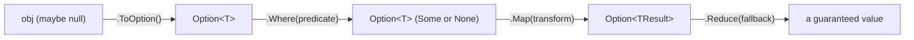

# AceLand Optional

A tiny, null-safe Option type for Unity — say goodbye to `NullReferenceException`.

## In One Line
Null is a landmine; Option is the metal detector.

## Overview
`AceLand.Optional` gives you a small value type that represents "a value that may or may not be
there", instead of leaning on `null` and hoping every caller remembers to check it.

It ships two flavours:

- `Option<T>` — for **reference types** (classes), such as a `Transform`, a `Player`, or any of your
  own objects.
- `ValueOption<T>` — for **value types** (`unmanaged` structs), such as `int`, `float`, or your own
  small structs.

Both wrap a possibly-missing value and give you a fluent, functional way to transform, filter and
unwrap it. You never touch the raw `null` yourself — you `Map` it, `Where` it, and finally `Reduce`
it back to a concrete value with a guaranteed fallback.

Because both types are `struct`s, wrapping a value does not allocate on the heap, so an `Option` is
cheap to create and pass around.

## Package Info
| | |
| --- | --- |
| display name | AceLand Optional |
| package name | com.aceland.optional |
| latest version | 3.0.0 |
| namespace | AceLand.Optional |
| git repository | [https://github.com/parsue/com.aceland.optional.git](https://github.com/parsue/com.aceland.optional.git) |
| unity | 2022.3 or newer |
| dependencies | none |

---

## Why Use It
- **No more silent `null`.** An `Option<T>` says out loud, in the type signature, that a value might
  be missing — so callers cannot forget to handle the empty case.
- **One safe exit point.** Every chain ends in `Reduce(...)`, which always returns a real value.
  There is no code path where you accidentally use a `null`.
- **Fluent transforms.** `Map`, `Where` and `Reduce` let you describe "if there is a value, do this,
  otherwise fall back to that" in a single readable line.
- **No heap allocation.** Both `Option<T>` and `ValueOption<T>` are `struct`s, so wrapping a value
  costs nothing on the garbage collector.
- **Reads like plain English.** `player.ToOption().Where(p => p.IsAlive).Reduce(Player.Dummy)` tells
  the whole story at a glance.

---

## How It Works
An `Option` is just a small struct holding an optional value. It is in one of two states:

- **Some** — it holds a value.
- **None** — it is empty.

You create one, transform it through zero or more steps, then collapse it back to a concrete value.



The key idea: **the missing-value check happens once, inside the Option**, and every downstream step
simply does nothing when the value is absent. Your own code never writes an `if (x == null)` again.

---

## Quick Start

### 1. Wrap a reference and read it safely
Turn a possibly-`null` object into an `Option<T>`, then unwrap it with a guaranteed fallback.



```csharp
using AceLand.Optional;
using UnityEngine;

public class TargetExample : MonoBehaviour
{
    [SerializeField] private Transform target; // might be null in the Inspector

    private void Start()
    {
        // Wrap the field. If it is null, we get a "None"; otherwise a "Some".
        Transform result = target
            .ToOption()                 // Option<Transform>
            .Reduce(transform);         // fall back to this object's transform

        // "result" is never null here.
        Debug.Log(result.name);
    }
}
```



```csharp
using AceLand.Optional;
using UnityEngine;

public class ScoreExample : MonoBehaviour
{
    private void Start()
    {
        int? savedScore = LoadScore(); // may be null

        // Wrap a nullable value type and give it a default.
        int score = ValueOption<int>.Some(savedScore)
            .Reduce(0);   // 0 when there was nothing saved

        Debug.Log($"Score: {score}");
    }

    private int? LoadScore() => null; // pretend there is no save yet
}
```




`Reduce` always returns a real value. Once you call it, you are back in normal, null-free code.


### 2. Filter and transform in one chain
Only keep the value if it passes a test, transform it, then fall back if anything dropped out.

```csharp
using AceLand.Optional;
using UnityEngine;

public class GreetingExample : MonoBehaviour
{
    private void Greet(Player player)
    {
        // "If we have a living player, take their name, else use 'Guest'."
        string name = player
            .ToOption()                      // Option<Player>
            .Where(p => p.IsAlive)           // drop it if not alive
            .Map(p => p.Name)                // Option<string>
            .Reduce("Guest");                // guaranteed value

        Debug.Log($"Hello, {name}!");
    }
}
```

### 3. Check presence directly
An `Option` converts implicitly to `bool`, so you can use it straight in an `if`.

```csharp
Option<Player> maybePlayer = FindPlayer().ToOption();

if (maybePlayer)                 // true only when a value is present
    Debug.Log("Player found.");
else
    Debug.Log("No player.");
```


`Option<T>` is only for **reference types** (`where T : class`), and `ValueOption<T>` is only for
**unmanaged value types** (`where T : unmanaged`). Pick the one that matches your data. See
[Option vs ValueOption](option-vs-valueoption.md).


---

## Bridging Between the Two
You can hop between the reference world and the value world mid-chain, using the `MapValue` /
`MapOptional` family:

```csharp
// Reference -> value: get a Player's health as a ValueOption<int>
int health = player
    .ToOption()
    .MapValue(p => p.Health)   // ValueOption<int>
    .Reduce(0);

// Value -> reference: turn an id into a lookup that might fail
Option<Player> found = playerId
    .ToValueOption()
    .Map(id => Registry.Find(id)); // Option<Player>, None if Find returns null-mapped result
```

See [Functional API](functional-api.md) for the full set of `Map`, `Where` and `Reduce` overloads.

---

## Best Practices
- Return `Option<T>` from methods that might not find a result, instead of returning `null`.
- End every chain with `Reduce(...)` so you always hand back a concrete, non-null value.
- Use `Where` / `WhereNot` to express business rules ("only if alive", "only if not expired")
  inside the chain, rather than with separate `if` statements.
- Prefer the `ToOption()` / `ToValueOption()` extensions to create an Option from existing data.
- Keep `Map` functions small and pure — they should only transform the value, not cause side effects.
